# ReportSmith - Architecture Diagrams

**Document Version**: 1.0  
**Last Updated**: November 7, 2025

This document contains comprehensive architecture diagrams for ReportSmith in Mermaid format.

---

## 1. System Context Diagram

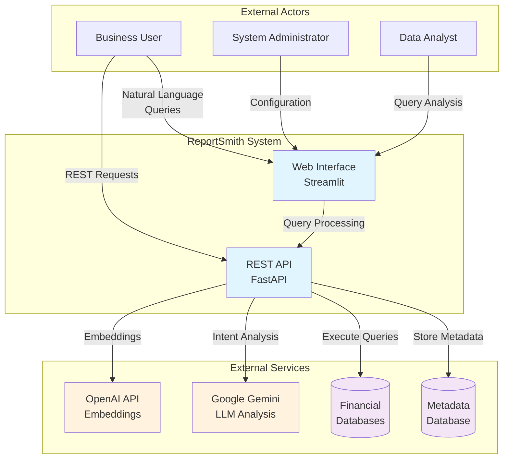

---

## 2. High-Level Architecture

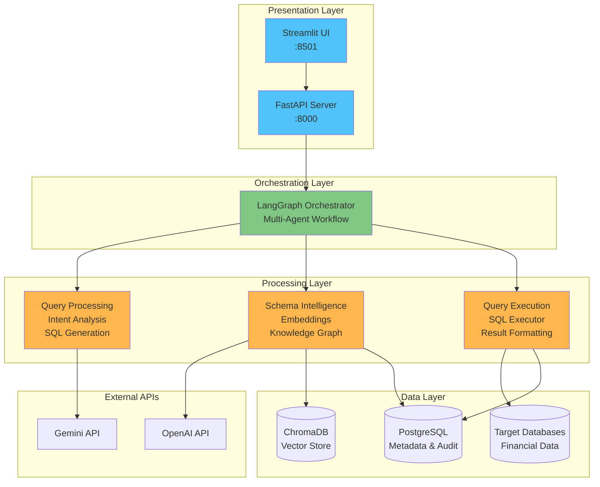

---

## 3. Query Processing Flow

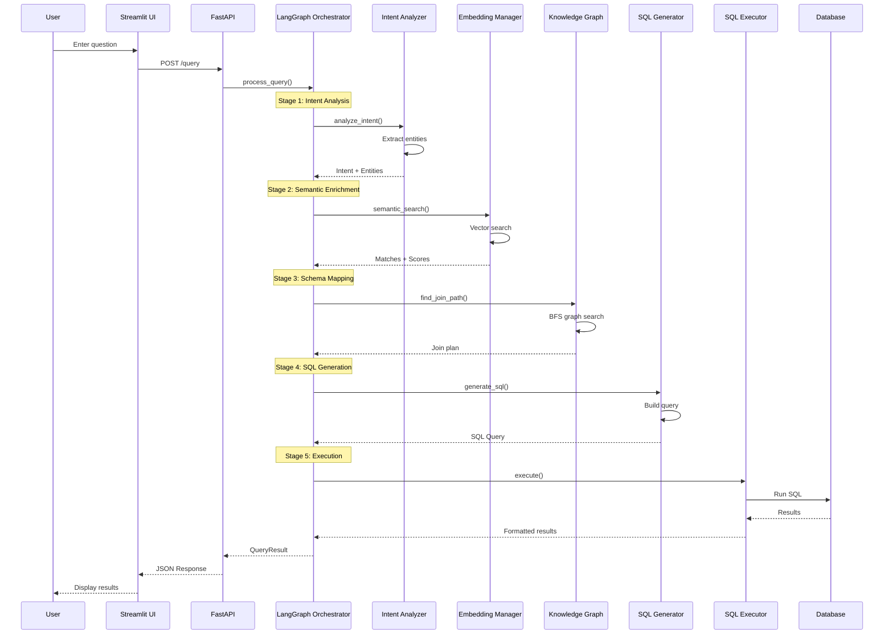

---

## 4. Multi-Agent Workflow

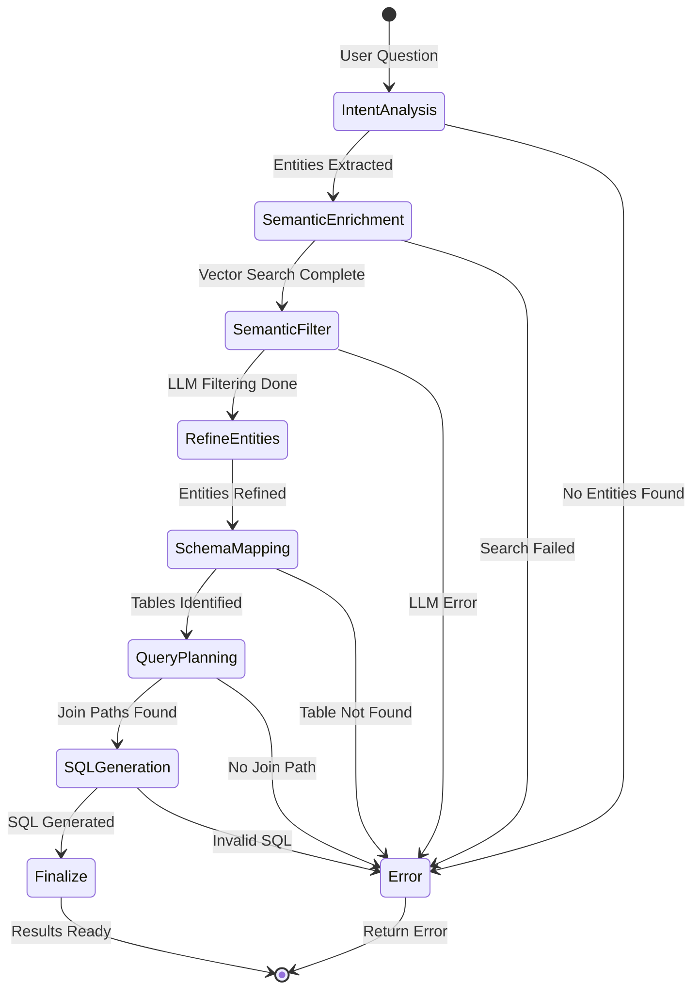

---

## 5. Component Architecture

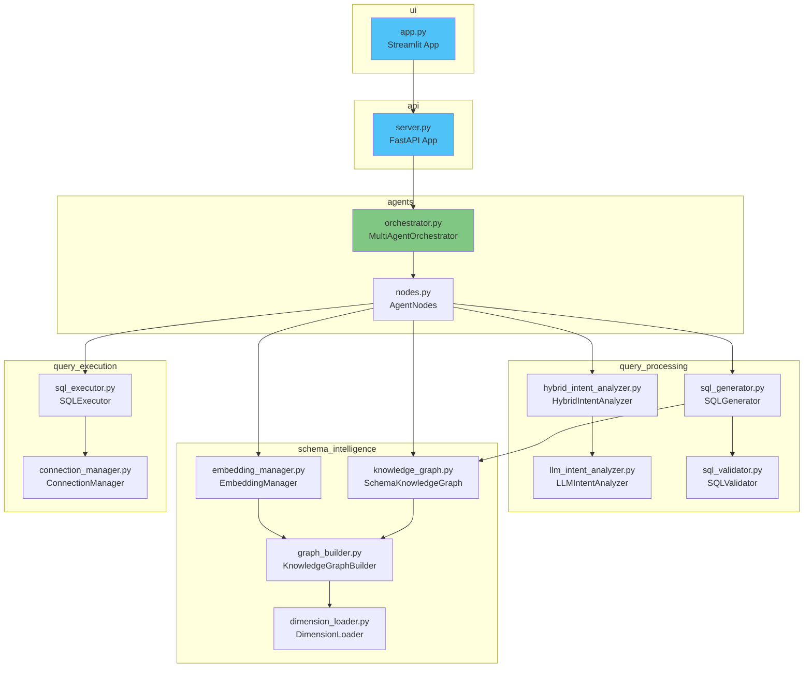

---

## 6. Data Flow Architecture

```mermaid
flowchart LR
    subgraph Input
        Q[Natural Language<br/>Question]
    end
    
    subgraph "Stage 1: Intent"
        I1[Extract<br/>Entities]
        I2[Identify<br/>Intent Type]
    end
    
    subgraph "Stage 2: Semantic"
        S1[Embed<br/>Query]
        S2[Vector<br/>Search]
        S3[Find<br/>Matches]
    end
    
    subgraph "Stage 3: Filter"
        F1[LLM<br/>Analysis]
        F2[Filter<br/>Results]
    end
    
    subgraph "Stage 4: Schema"
        SC1[Map<br/>Tables]
        SC2[Map<br/>Columns]
        SC3[Find<br/>Relations]
    end
    
    subgraph "Stage 5: Plan"
        P1[Build<br/>Join Path]
        P2[Apply<br/>Filters]
        P3[Create<br/>Plan]
    end
    
    subgraph "Stage 6: SQL"
        SQ1[Generate<br/>SELECT]
        SQ2[Generate<br/>FROM/JOIN]
        SQ3[Generate<br/>WHERE]
        SQ4[Assemble<br/>SQL]
    end
    
    subgraph "Stage 7: Execute"
        E1[Connect<br/>DB]
        E2[Run<br/>Query]
        E3[Format<br/>Results]
    end
    
    subgraph Output
        R[Query<br/>Results]
    end
    
    Q --> I1 --> I2
    I2 --> S1 --> S2 --> S3
    S3 --> F1 --> F2
    F2 --> SC1 --> SC2 --> SC3
    SC3 --> P1 --> P2 --> P3
    P3 --> SQ1 --> SQ2 --> SQ3 --> SQ4
    SQ4 --> E1 --> E2 --> E3
    E3 --> R
```

---

## 7. Knowledge Graph Structure

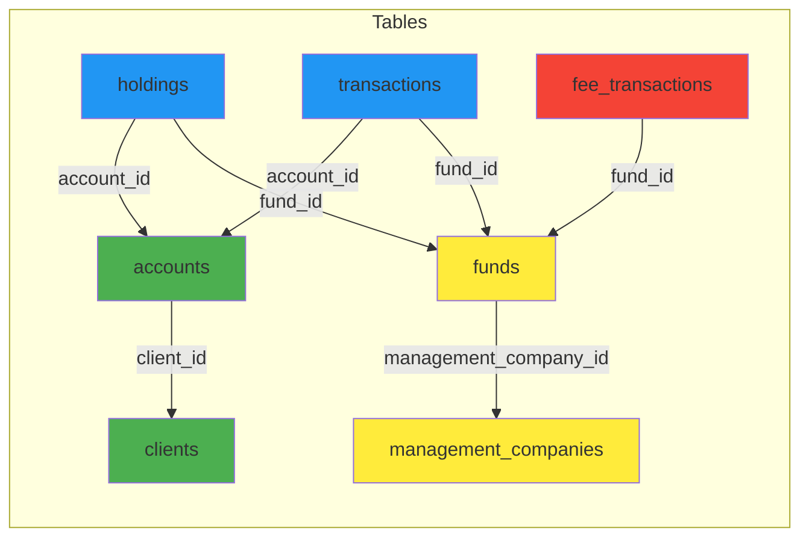

---

## 8. Embedding Collections Architecture

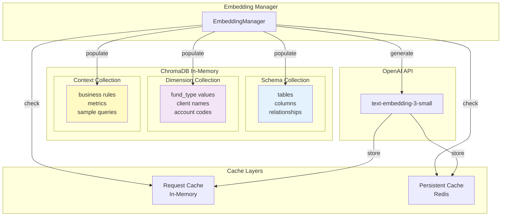

---

## 9. SQL Generation Process

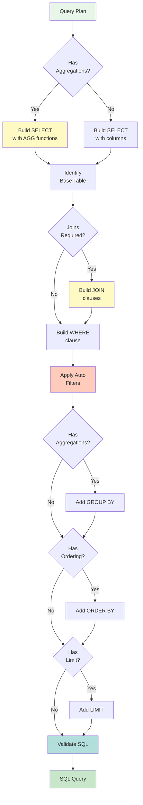

---

## 10. Deployment Architecture

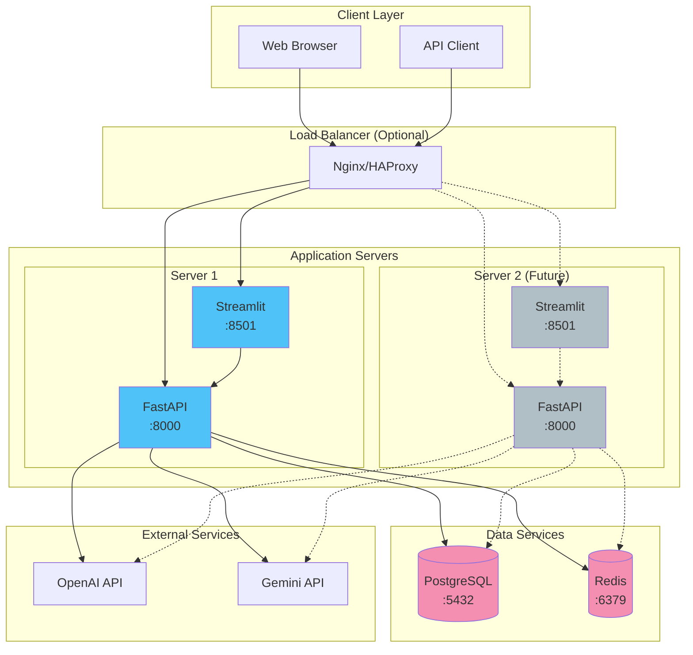

---

## 11. Security Architecture

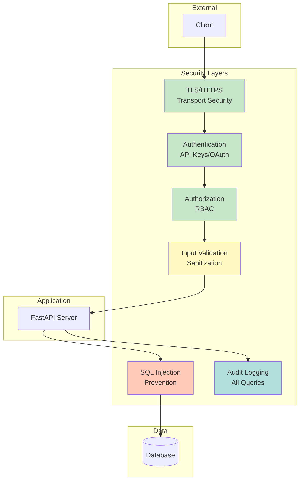

---

## 12. Error Handling Flow

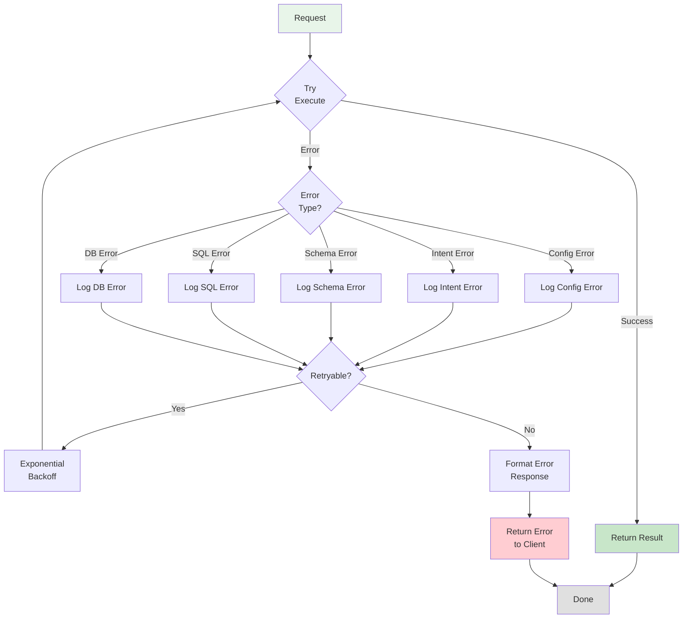

---

## 13. Monitoring and Observability

```mermaid
graph TB
    subgraph "Application"
        API[FastAPI Server]
        UI[Streamlit UI]
    end
    
    subgraph "Logging"
        AppLog[Application Logs<br/>logs/app.log]
        UILog[UI Logs<br/>logs/ui.log]
        DebugLog[Debug Logs<br/>logs/semantic_debug/]
    end
    
    subgraph "Metrics (Future)"
        Metrics[Prometheus<br/>Metrics]
        Dashboard[Grafana<br/>Dashboard]
    end
    
    subgraph "Health Checks"
        Health[/health endpoint]
        Ready[/ready endpoint]
    end
    
    subgraph "Monitoring System (Future)"
        Monitor[Monitoring Service<br/>Datadog/New Relic]
    end
    
    API --> AppLog
    API --> Metrics
    API --> Health
    API --> Ready
    
    UI --> UILog
    
    API --> DebugLog
    
    Metrics --> Dashboard
    
    AppLog --> Monitor
    UILog --> Monitor
    Metrics --> Monitor
    Health --> Monitor
    Ready --> Monitor
    
    style API fill:#4fc3f7
    style UI fill:#4fc3f7
    style Monitor fill:#ffb74d
```

---

## 14. Database Schema (Metadata)

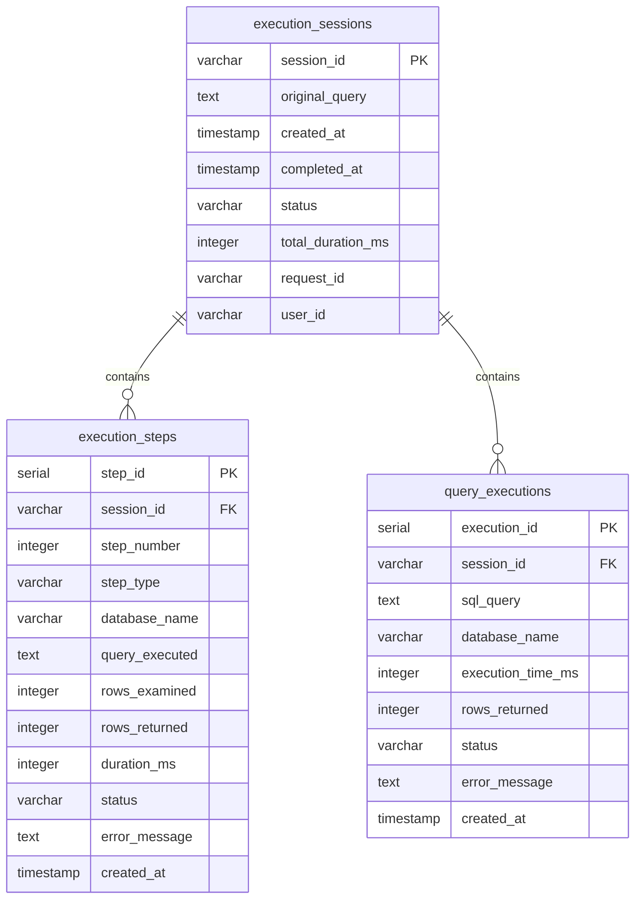

---

## 15. Configuration Management

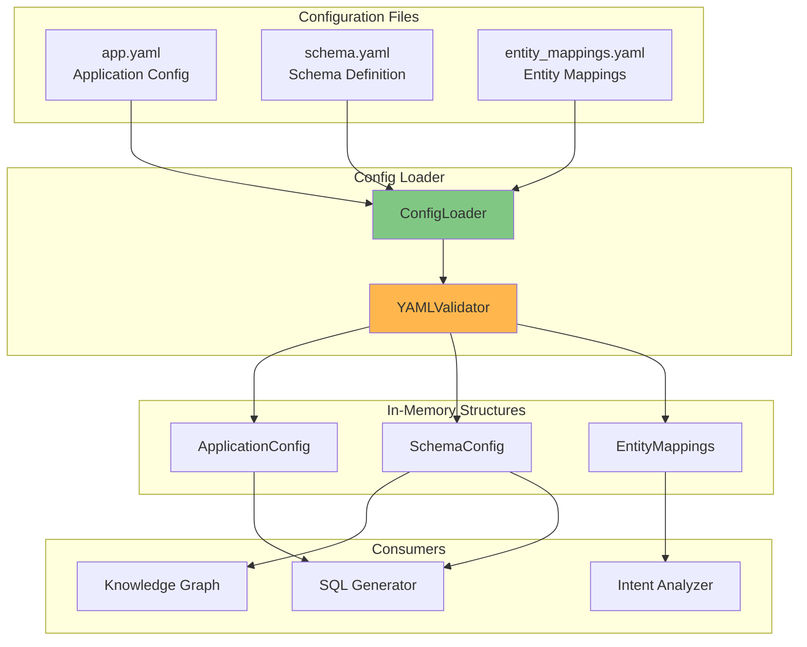

---

## How to View These Diagrams

These diagrams are written in Mermaid syntax and can be viewed in:

1. **GitHub**: Automatically rendered in `.md` files
2. **VS Code**: Install "Markdown Preview Mermaid Support" extension
3. **Online**: Copy to https://mermaid.live/
4. **Documentation Sites**: Render with MkDocs, Docusaurus, etc.

---

**Document Control**  
**Version**: 1.0  
**Last Updated**: November 7, 2025  
**Author**: Development Team
